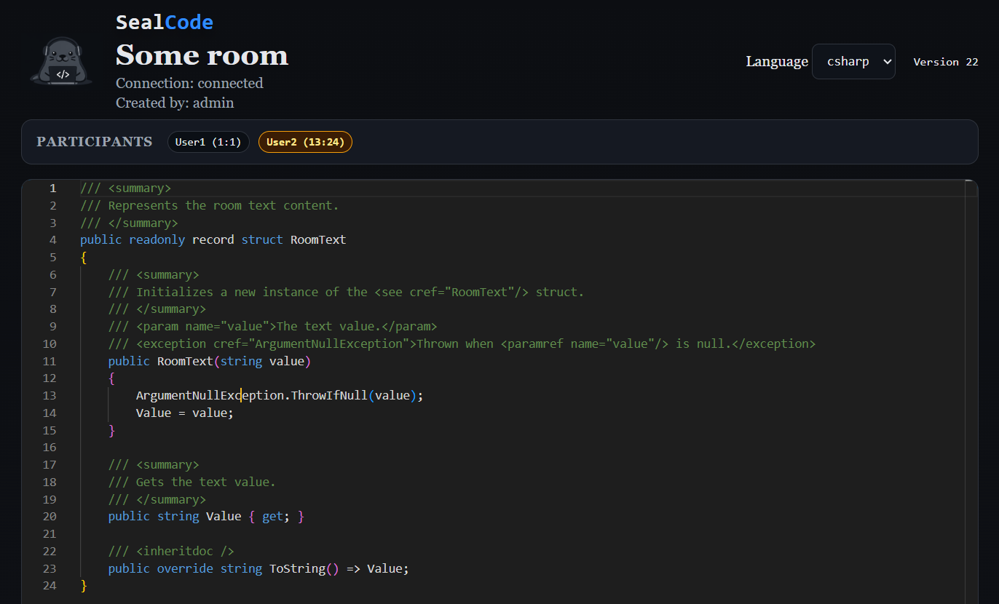
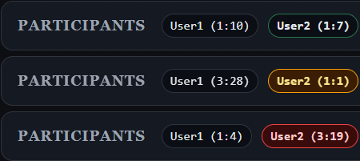

# SealCode

SealCode is a self-hosted collaborative code editor with real-time rooms. The backend is ASP.NET Core Minimal API + SignalR, and the browser UI uses Monaco Editor with Yjs for CRDT syncing. Rooms are in-memory only (no database or persistence).



**Features**
- Real-time multi-user editing with presence and cursors.
- Room-based sessions with an admin UI to create and close rooms.
- Syntax highlighting with language switching.
- Configurable room capacity.

**Collaboration**

SealCode uses Yjs (CRDT) to merge concurrent edits. Each client produces incremental updates that the server broadcasts to the room.

**Quick Start**
1. Run the server:

```bash
dotnet run --project src/SealCode/SealCode.csproj
```

2. Open the app at `http://localhost:5000` (or the URL shown in the console).

**Admin Workflow**
1. Visit `/admin/login`.
2. Sign in with a user from `src/SealCode/appsettings.json` (`AdminUsers`).
3. Create a room and share its link with participants.

**Join a Room**
Open the room link in a browser and enter a display name.

**Configuration**
- `src/SealCode/appsettings.json`
- `AdminUsers`: list of admin name/password pairs. Include `IsSuperAdmin` to allow deleting rooms created by other admins.
- `Languages`: list of language identifiers supported by Monaco Editor (example: `csharp`, `sql`).
- `MaxUsersPerRoom`: integer from 1 to 5.

**Endpoints**
- `/` landing page
- `/about.html` about page with repository link
- `/room/{roomId}` room UI
- `/admin` admin panel
- `/admin/login` admin login
- `/health` health check
- `/roomHub` SignalR hub


**UI Indication**

The user's cursor position is displayed in the following format:

`User1 (14:25)`

Where:

- `User1` — the user  
- `14` — the line number  
- `25` — the column number (character position within the line)

🎨 The interface uses color cues to reflect user actions and interaction states.



| Color  | Meaning | Description |
|--------|----------|-------------|
| 🟢 Green | Typing | User is actively typing in an input or editor field. |
| 🟠 Orange | Multi-selection | Multiple rows/items are selected. |
| 🔴 Red | Copied | Text has been successfully copied to the clipboard. |
